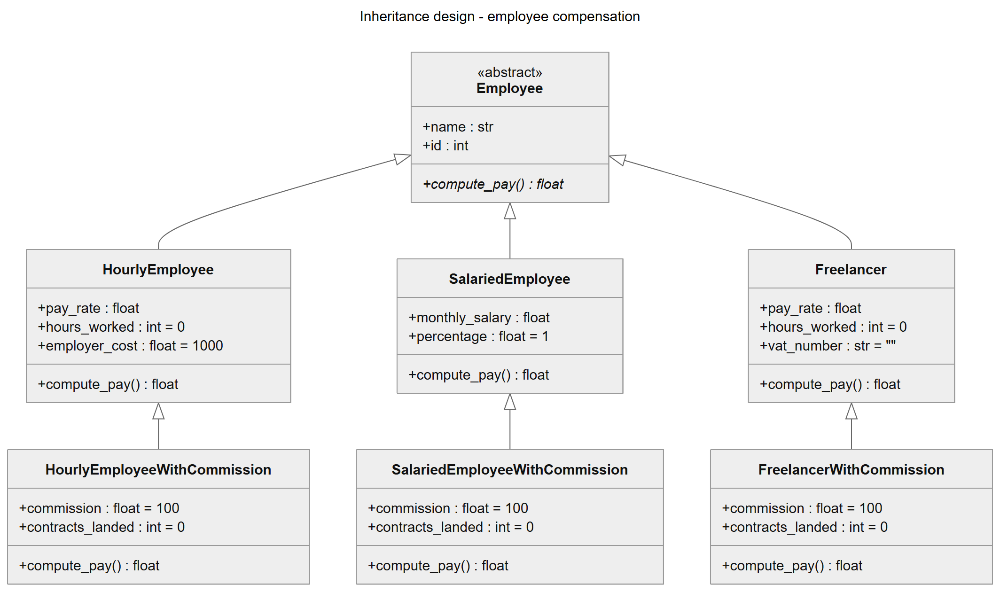
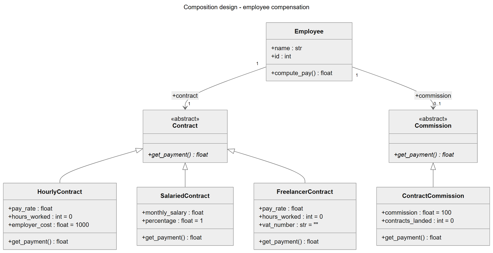

# Composition over Inheritance — Employee Compensation

Homework for **Diseño de Software (ESI1005O, ITESO, Fall 2026)**.

The employee-compensation example from class, based on
[ArjanCodes — Composition vs Inheritance](https://github.com/ArjanCodes/2021-composition-vs-inheritance),
implemented twice:

| Folder | Design | Idea |
|---|---|---|
| [`inheritance/`](inheritance/) | Inheritance | Each pay type *is an* `Employee`; each pay type + commission needs its own `…WithCommission` subclass. |
| [`composition/`](composition/) | Composition | One `Employee` class that **has a** `Contract` and **may have a** `Commission`. |
| [`uml/`](uml/) | UML class diagrams | Mermaid source (`.mmd`) plus rendered `.svg` / `.png` for both designs. |

Both versions follow the **one class per source file** rule; `main.py` in each folder
is the runnable example that builds the same six employees and prints `compute_pay()`.

## Requirements

- Python 3.9 or newer (standard library only, nothing to install).

## How to run

From the repository root:

```bash
python inheritance/main.py
```

```bash
python composition/main.py
```

Or from inside each folder:

```bash
cd inheritance
python main.py
```

Expected output (identical in both versions except for the title line):

```text
Payroll - inheritance design
----------------------------------------------------
Henry  #12346  Hourly                   $  6,000.00
Sarah  #47832  Salaried + commission    $  6,000.00
Maria  #51234  Salaried                 $  2,000.00
Tom    #60987  Freelancer               $  2,400.00
Lucia  #73456  Hourly + commission      $  4,500.00
Diego  #88901  Freelancer + commission  $  1,900.00
----------------------------------------------------
Total                                   $ 22,800.00
```

### Checking that both designs behave the same

```bash
python verify_equivalence.py
```

It runs both `main.py` scripts and fails if their payroll lines differ.

## Structure

```text
inheritance/
  employee.py                           Employee (abstract)
  hourly_employee.py                    HourlyEmployee(Employee)
  salaried_employee.py                  SalariedEmployee(Employee)
  freelancer.py                         Freelancer(Employee)
  hourly_employee_with_commission.py    HourlyEmployeeWithCommission(HourlyEmployee)
  salaried_employee_with_commission.py  SalariedEmployeeWithCommission(SalariedEmployee)
  freelancer_with_commission.py         FreelancerWithCommission(Freelancer)
  main.py                               runnable example
composition/
  employee.py                           Employee (has a Contract, may have a Commission)
  contract.py                           Contract (abstract)
  hourly_contract.py                    HourlyContract(Contract)
  salaried_contract.py                  SalariedContract(Contract)
  freelancer_contract.py                FreelancerContract(Contract)
  commission.py                         Commission (abstract)
  contract_commission.py                ContractCommission(Commission)
  main.py                               runnable example
uml/
  inheritance.mmd / .svg / .png
  composition.mmd / .svg / .png
verify_equivalence.py                   compares the output of both versions
```

## UML

### Inheritance version



### Composition version



Notation: hollow-triangle arrows are **generalization** (IS-A); solid arrows are navigable
**associations** (Employee keeps a reference to its collaborators) with multiplicities
`1` (contract) and `0..1` (commission). Abstract classes are marked `«abstract»` and
abstract operations are in *italics*. Object composition is modelled as a plain
association, not a UML black-diamond composition, because contracts and commissions are
created outside `Employee` and passed in.
